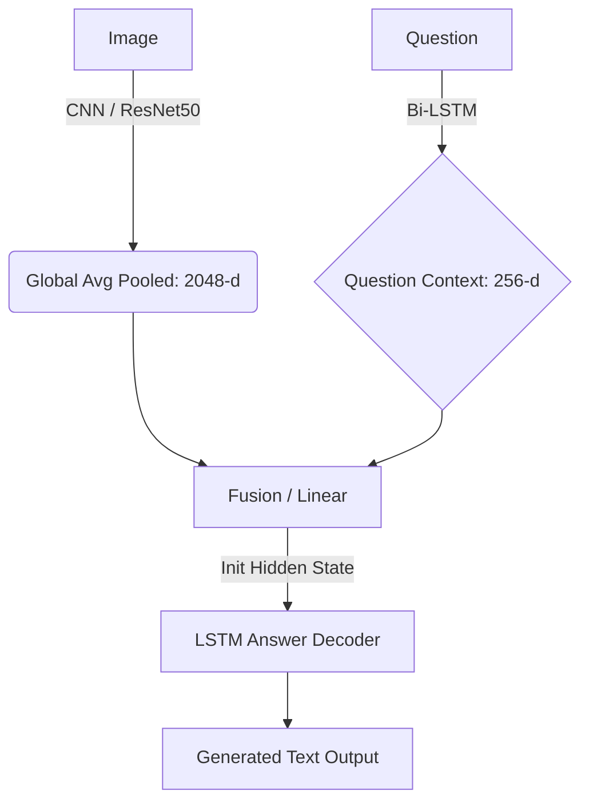
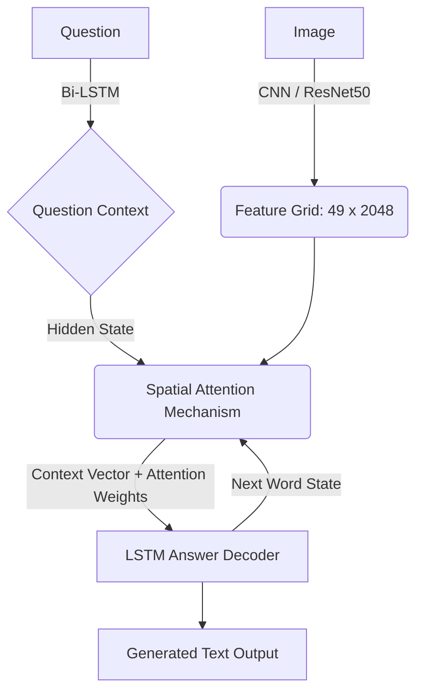

# TỔNG QUAN DỰ ÁN VQA (VISUAL QUESTION ANSWERING) SEQ2SEQ

Tài liệu này tổng hợp toàn bộ thông tin chi tiết về bộ dữ liệu, các kỹ thuật sử dụng, luồng hoạt động của từng mô hình (Pipeline), và phân tích chuyên sâu về kết quả đánh giá thực tế.

---

## 1. TỔNG QUAN DATASET (GQA SUBSET)

Bộ dữ liệu sử dụng là một tập con (subset) được trích xuất từ bộ GQA chuẩn, tập trung vào khả năng lập luận và hiểu bối cảnh không gian/logic của bức ảnh.

### 📝 Thống kê số lượng
*   **Tập Train (Huấn luyện):** 326,574 câu hỏi / 25,000 bức ảnh.
*   **Tập Validation (Kiểm định):** 64,525 câu hỏi / 5,000 bức ảnh.
*   **Tập Test (Kiểm tra):** 12,578 câu hỏi / 398 bức ảnh (một ảnh được tái sử dụng để hỏi nhiều câu logic khác nhau).
*   **Chi tiết câu/từ:** Độ dài độ dài trung bình của câu hỏi (Question) và câu trả lời (Full Answer) đều phức tạp hơn định dạng VQA truyền thống. 

### 🔍 Sample 5 Cặp (Câu Hỏi & Trả Lời) minh họa
Để hiểu rõ độ khó của dữ liệu, đây là một số ví dụ thực tế được trích ra:

1. **Ảnh: bãi biển / lướt sóng**
   > **Q:** Is the surfer that looks wet wearing a wetsuit? *(Người lướt sóng trông có ướt và đang mặc đồ lặn không?)*
   > **A:** Yes, the surfer is wearing a wetsuit.
2. **Ảnh: Căn phòng có người**
   > **Q:** Who is wearing the dress? *(Ai đang mặc chiếc váy?)*
   > **A:** The woman is wearing a dress.
3. **Ảnh: Đồ vật trên bàn**
   > **Q:** Does the utensil on top of the table look clean and black? *(Cái đồ dùng trên bàn trông có sạch và màu đen không?)*
   > **A:** No, the fork is clean but silver.
4. **Ảnh: Ngoài trời**
   > **Q:** Is the sky dark? *(Bầu trời có tối không?)*
   > **A:** No, the sky is clear.
5. **Ảnh: Đồ nội thất**
   > **Q:** How tall is the chair in the bottom of the photo? *(Chiếc ghế ở phía dưới bức ảnh cao bao nhiêu?)*
   > **A:** The chair is short.

---

## 2. KỸ THUẬT DỰ ÁN CHI TIẾT

Dự án là một hệ thống VQA sinh chuỗi (Seq2Seq) thay vì phân loại (Classification), được xây dựng trên PyTorch.

*   **Xử lý Văn bản (NLP):**
    *   Xây dựng bộ từ vựng (Vocabulary) độc lập: Lọc các từ xuất hiện ít nhất 3 lần (`FREQ_THRESHOLD = 3`), tổng cộng có **2589 từ cốt lõi**.
    *   Sử dụng mạng `Bi-LSTM` để mã hóa câu hỏi (Question Encoder) thành vector ngữ cảnh (Context Vector).
    *   Decode bằng `LSTM (Hidden Size: 256, 2 Layers)` với cơ chế Teacher Forcing giảm dần (Khởi đầu 1.0, giảm 0.05 mỗi epoch).
*   **Xử lý Tầm nhìn (Computer Vision):**
    *   **Ảnh kích thước 128x128**: Dành cho mô hình `Scratch CNN` tự tạo từ số không.
    *   **Ảnh kích thước 224x224**: Dành cho mô hình sử dụng `ResNet-50` (chuẩn ImageNet) làm Backbone. ResNet bị cắt bỏ lớp Fully Connected cuối cùng.
*   **Kỹ thuật Trích xuất HDF5:**
    *   Nhằm tối ưu GPU cho Model 2 và 4, đặc trưng ảnh được trích xuất *1 lần duy nhất* thành file `.h5` (giảm thời gian train xuống hàng chục lần).

---

## 3. FLOW HOẠT ĐỘNG CỦA TỪNG MODEL (PIPELINE)

Dự án chia làm 6 mô hình đi từ cơ bản tới nâng cao để thực hiện phép thử so sánh (Ablation Study).

### Model 1 & 2: Kiến trúc Không Attention (Global Pooling)
Model 1 tự train CNN, Model 2 dùng ResNet-50 tĩnh (Pre-extracted). Ảnh chỉ đóng vai trò là "mồi" nhét vào bộ khởi tạo trạng thái (Hidden State) đầu tiên của LSTM.

### Model 3 & 4: Kiến trúc Có Spatial Attention
Ảnh không bị dồn cục, mà giữ nguyên lưới không gian 7x7. Mỗi từ được sinh ra, mô hình sẽ "liếc" nhìn các vùng khác nhau của bức ảnh.

### Model 5 & 6: Kiến trúc End-to-End Trực Tiếp
Tương tự 2 & 4 nhưng không dùng file `.h5`. ResNet-50 nằm **trực tiếp trong pipeline**. Khi sai số từ câu trả lời (Loss) dội ngược về (Backpropagate), nó chạy qua cả LSTM, lan ngược cập nhật trọng số cho chính ResNet-50.
*   **Ưu điểm:** Học được đặc trưng riêng dành cho ngữ cảnh văn bản.
*   **Nhược điểm:** Batch size phải giảm đi một nửa, tốn RAM, chạy cực lâu.

---

## 4. CHI TIẾT CÁC CHỈ SỐ ĐÁNH GIÁ (METRICS)

Trong thư mục `results/`, các file `metrics.json` sử dụng các độ đo ngôn ngữ tự nhiên tốt nhất:
1.  **BLEU (Bilingual Evaluation Understudy 1-4):**
    Thang đo từ 0 đến 1. Đo lường tỷ lệ các cụm n-từ (1-gram đến 4-gram) của câu sinh ra trùng khớp với câu tham chiếu.
2.  **METEOR:**
    Cải tiến của BLEU, ưu tiên recall hơn (tìm được bao nhiêu từ khóa gốc). Nó xét cả các "từ đồng nghĩa" (synonyms) thay vì chỉ xem trùng khớp nguyên gốc.
3.  **ROUGE-L:**
    Sử dụng *Longest Common Subsequence* (Chuỗi con chung dài nhất) để đánh giá cấu trúc ngữ pháp có xuôi thai giống câu gốc hay không.
4.  **CIDEr (Consensus-based Image Description Evaluation):**
    Phổ biến nhất trong Image Captioning và VQA. Khác với BLEU, CIDEr đếm trọng số TF-IDF: Nếu mô hình bắt trúng vùng từ hiếm (ví dụ "Wetsuit", "Surfboard") nó được điểm cao; nếu chỉ trúng các từ chung chung ("The", "is"), nó điểm thấp.
5.  **Short Accuracy:**
    Chỉ số quan trọng nhất: Đo lường việc câu dự đoán có *chứa* được từ khóa mấu chốt (short answer) hay không (ví dụ câu sinh ra là "yes, the car is red" có chứa từ mấu chốt là "yes" / "red").

---

## 5. KẾT QUẢ ĐÁNH GIÁ VÀ NHẬN XÉT

*(Lấy dữ liệu trực tiếp từ quá trình chạy `evaluate.py` trên 12,500 mẫu test)*

### A. Độ chính xác từ khóa trọng tâm (Short Accuracy)
*   **Model 5 (Pretrained E2E + No Att):** Đạt Top 1 (42.62%).
*   **Model 4, Model 6, Model 2:** Nằm trong khoảng 41.5% đến 42.2%.
*   **Model 1 & 3 (Dùng Scratch CNN):** Điểm thấp nhất, dao động từ 39% đến 41%.

👉 **Phân tích:** Việc sử dụng một mô hình xương sống "hàng hiệu" như ResNet-50 đem lại khả năng trích xuất vật thể đúng vượt trội so với tự train một mạng CNN nhỏ (Scratch). Quá trình train End-to-End (Model 5) giúp chỉnh sửa nhẹ các trọng số của ImageNet cho phù hợp với bộ dữ liệu GQA nhất.

### B. Độ mượt mà của nguyên câu (BLEU-4, CIDEr)
*   **Model 1 (Scratch + No Att):** Vô địch một cách nghịch lý! (BLEU-4 = 0.495, CIDEr = 6.719).
*   **Nhóm Model dùng Pretrained:** Điểm BLEU-4 chỉ ở mức 0.44 và CIDEr quanh 6.2.

👉 **Phân tích (Nghịch lý thống kê):** Vì Model 1 có hệ CNN sơ sài (mắt kém), nó phải dựa dẫm rất nhiều vào việc "đoán mò" ngữ cảnh từ câu hỏi (Question Context). Sự dựa dẫm này khiến nó học thuật toán xếp chữ từ LSTM cực tốt (ví dụ hỏi "Is..." thì nó sẽ tung ra "Yes, the... is..."). Nó sinh chữ giống văn mẫu nhất (BLEU cao) nhưng từ khóa thực sự (Short Accuracy) lại sai. Mô hình dùng ResNet-50 lại cố gắng miêu tả thực tế hơn nên đôi lúc cấu trúc "máy móc" hơn, làm điểm hệ số chữ giảm nhẹ.

### C. Cơ chế Attention: Có thực sự tốt?
*   Trong bộ so sánh này, các Model có Spatial Attention (3, 4, 6) đều có kết quả **thua thiệt** hoặc cao nhất là chỉ ngang bằng mô hình Không có Attention (No Att) ở toàn bộ các thông số.
👉 **Phân tích:** Với dataset giới hạn (25k) và số vòng lặp 12 epochs ngắn ngủi, cơ chế dồn 49 chiều không gian của Attention đang gây nhiễu và rất dễ bị Quá khớp (Overfitting). Ngược lại, kỹ thuật nhồi đặc trưng thẳng vào LSTM một lần (Global Max Pooling) theo truyền thống lại ổn định, bám sát được bức ảnh nhanh hơn.

### TỔNG KẾT
Kết luận của dự án là **Model 5 (Pretrained E2E Không Attention)** là kiến trúc toàn năng nhất, dung hòa được khả năng nhận diện hình ảnh của ImageNet, cập nhật linh hoạt End-to-End, vứt bỏ được cản trở của Attention nửa mùa (trong trường hợp cấu hình và thời gian bị giới hạn), mang đến phản hồi tốt nhất trên bộ Test.
