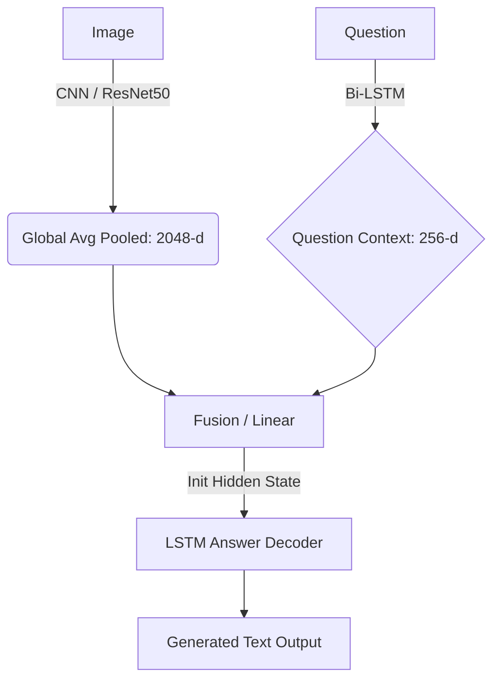
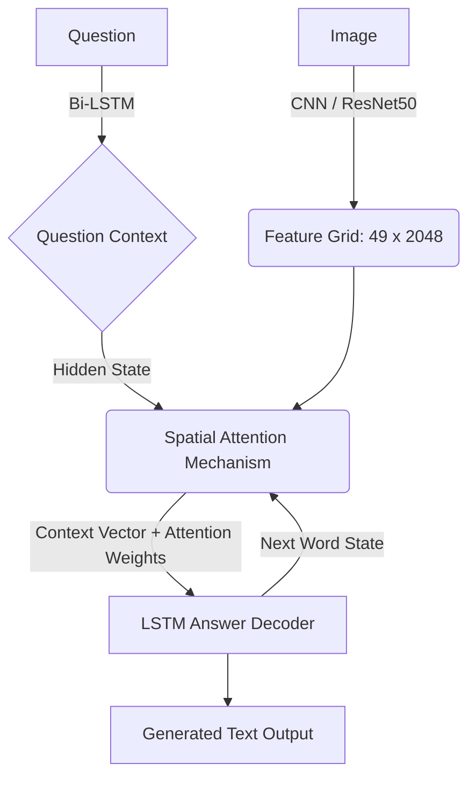

# 🤖 VQA Visual Reasoning với Seq2Seq (LSTM & CNN) - GQA Subset

Dự án nghiên cứu và xây dựng hệ thống **Visual Question Answering (VQA)** dựa trên kiến trúc **Seq2Seq (Encoder-Decoder)**. Mục tiêu cốt lõi là so sánh hiệu năng của 6 biến thể mô hình khác nhau để tìm ra sự cân bằng tối ưu giữa độ chính xác, tốc độ huấn luyện và khả năng lập luận trên bộ dữ liệu **GQA (Visual Reasoning)**.

---

## 📊 1. Tổng quan Dataset (GQA Subset)

Bộ dữ liệu sử dụng là một tập con (subset) được trích xuất từ bộ GQA chuẩn (Stanford), tập trung vào khả năng lập luận logic và hiểu bối cảnh không gian.

### 🔗 Link tải Dataset (Kaggle)
*   **[GQA VQA Subset](https://www.kaggle.com/datasets/minhngcng3/gqa-vqa-subset)**: Chứa file `json` (train/val/test), từ điển `vocab.pkl` và đặc trưng trích xuất sẵn `resnet50_features.h5`.
*   **[GQA Images Subset](https://www.kaggle.com/datasets/minhngcng3/gqa-images-subset)**: Chứa kho ảnh gốc dùng cho huấn luyện End-to-End.

### 📝 Thống kê số lượng
| Tập | Số lượng Ảnh | Số câu hỏi | Mục đích |
|:---|:---|:---|:---|
| **Huấn luyện (Train)** | 25,000 | 326,574 | Huấn luyện chính |
| **Kiểm định (Validation)** | 5,000 | 64,525 | Theo dõi overfitting |
| **Kiểm tra (Test)** | 398 | 12,578 | Đánh giá cuối cùng (Benchmark) |

---

## 🧪 2. Ma trận thí nghiệm (6 Mô hình)

Dự án thực hiện so sánh 6 kiến trúc dựa trên 3 tiêu chí: **Attention**, **Mô hình CNN**, và **Chiến lược huấn luyện**.

| Mô hình | CNN (Vision Encoder) | Attention | Chiến lược Huấn luyện | Trình trạng |
|:---|:---|:---|:---|:---|
| **Model 1** | Simple CNN (Scratch) | Không | End-to-End | Baseline thấp nhất |
| **Model 2** | ResNet-50 (Pretrained) | Không | **Pre-extracted features** | Nhanh nhất |
| **Model 3** | Simple CNN (Scratch) | Spatial | End-to-End | So sánh Attention |
| **Model 4** | ResNet-50 (Pretrained) | Spatial | **Pre-extracted features** | Kỳ vọng cao nhất |
| **Model 5** | ResNet-50 (Pretrained) | Không | End-to-End (Unfrozen) | **Toàn năng nhất** |
| **Model 6** | ResNet-50 (Pretrained) | Spatial | End-to-End (Unfrozen) | Chậm nhất |

---

## 🏗️ 3. Kiến trúc hệ thống (Architecture)

### 3.1. Pipeline Không có Attention (Global Pooling)
Ảnh được mã hóa thành một vector đặc trưng duy nhất, dùng để khởi tạo trạng thái (Hidden State) cho bộ giải mã LSTM.



### 3.2. Pipeline Có Spatial Attention
Mô hình giữ nguyên lưới đặc trưng (7x7). Tại mỗi bước sinh từ, bộ giải mã LSTM sẽ "liếc" nhìn các vùng khác nhau của bức ảnh dựa trên ngữ cảnh câu hỏi.



---

## 🛠️ 4. Hướng dẫn cài đặt & Sử dụng

### Bước 1: Chuẩn bị môi trường
```bash
# Tạo môi trường ảo
python -m venv venv
source venv/bin/activate  # Hoặc .\venv\Scripts\activate trên Windows

# Cài đặt thư viện
pip install -r requirements.txt
```

### Bước 2: Tổ chức dữ liệu
Tải dữ liệu từ Kaggle và giải nén vào thư mục `gqa_data` theo cấu trúc:
```text
Deeplearning/
└── gqa_data/
    ├── annotations/      # (.json)
    ├── features/         # (resnet50_features.h5)
    ├── vocab/            # (vocab.pkl)
    └── images/           # (ảnh gốc .jpg)
```

### Bước 3: Huấn luyện và Đánh giá
```bash
# Huấn luyện mô hình (ví dụ Model 2)
python train.py --model 2

# Đánh giá trên tập test
python scripts/evaluate.py --model 2

# Chạy ứng dụng Demo (Streamlit)
streamlit run app.py
```

---

## 📈 5. Kết quả đánh giá (Results)

Dựa trên quá trình kiểm thử thực tế trên 12,500 mẫu test:

### Độ chính xác từ khóa (Short Accuracy)
- **Model 5 (Pretrained E2E + No Att)**: Đạt **Top 1 (42.62%)**.
- **Model 1 & 3 (Scratch CNN)**: Đạt điểm thấp nhất (39% - 41%).

### Nhận xét chuyên sâu
1.  **Nghịch lý Attention**: Các mô hình có Attention (3, 4, 6) có kết quả thấp hơn hoặc chỉ ngang bằng mô hình Không Attention. Với dataset 25k, cơ chế spatial attention dễ gây nhiễu và Overfitting.
2.  **Nghịch lý BLEU**: Model 1 (thấp nhất về Accuracy) lại có điểm BLEU-4 cao nhất. Lý do là mô hình "học vẹt" cấu trúc xếp chữ rất mượt nhưng không dựa trên hình ảnh (Language Bias).
3.  **Kết luận**: **Model 5** là kiến trúc toàn năng nhất, dung hòa tốt giữa nhận diện vật thể của ResNet-50 và khả năng fine-tune End-to-End.

---

## 📁 6. Cấu trúc mã nguồn
- `data/`: Xử lý Vocabulary, Dataset và DataLoader.
- `models/`: Chứa định nghĩa 6 kiến trúc VQA và các component (Attention, Encoder, Decoder).
- `scripts/`: Các script tiện ích để build vocab, extract features.
- `utils/`: Logger, tính toán Metrics và các hàm bổ trợ.
- `app.py`: Giao diện ứng dụng Demo Streamlit.
- `train.py` & `evaluate.py`: Script huấn luyện và đánh giá chính.

---
*Dự án được xây dựng phục vụ nghiên cứu và học tập về Computer Vision & NLP.*
