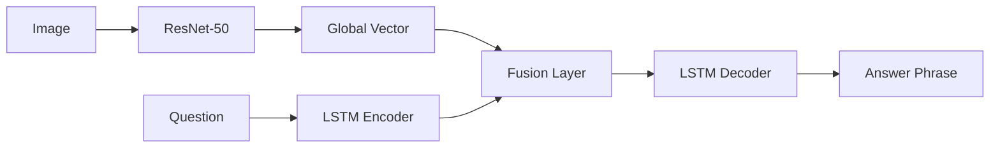
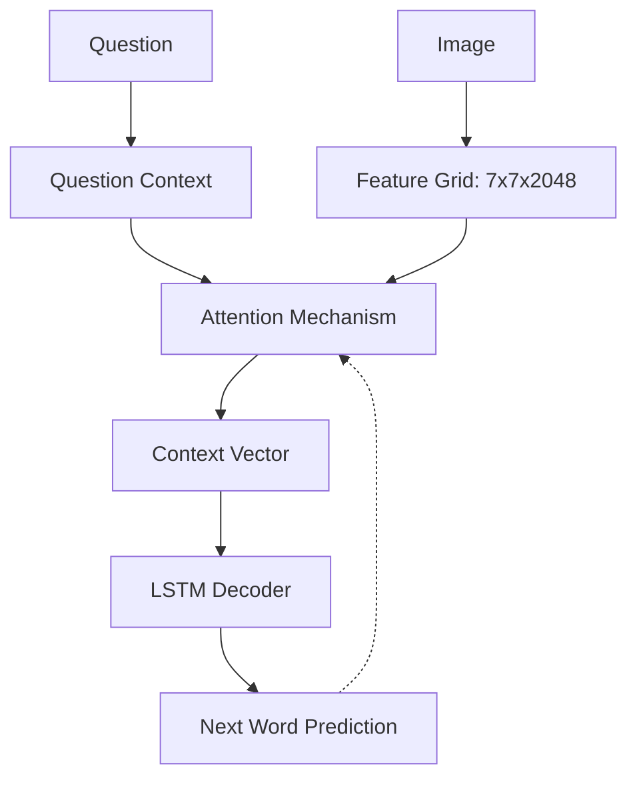

# 📊 Báo cáo Dự án: GQA Visual Reasoning System
## Hệ thống Trả lời Câu hỏi Hình ảnh (Visual Question Answering)

---

## 1. 🎯 Tổng quan bài toán
Dự án tập trung vào việc xây dựng và so sánh các kiến trúc mạng Deep Learning để giải quyết bài toán **Visual Question Answering (VQA)**. 

Khác với VQA thông thường, tập dữ liệu **GQA** yêu cầu mô hình phải có khả năng **lập luận logic** (Visual Reasoning) về mối quan hệ giữa các vật thể, thuộc tính và vị trí không gian.

### 📊 Thống kê Dataset (GQA Subset)
- **Ảnh**: 30,000+ (Train/Val/Test)
- **Câu hỏi**: ~400,000 câu
- **Đặc trưng**: Sử dụng ResNet-50 trích xuất đặc trưng không gian (Spatial Features).

---

## 2. 🏗️ Ma trận 6 Mô hình Thí nghiệm
Chúng ta đã thử nghiệm 6 cấu hình khác nhau dựa trên 3 trục thay đổi chính:

| Mô hình | CNN (Vision Encoder) | Cơ chế Attention | Chiến lược Huấn luyện |
|:---:|:---:|:---:|:---|
| **Model 1** | Simple CNN (Scratch) | ❌ Không | End-to-End |
| **Model 2** | ResNet-50 (Pretrained) | ❌ Không | Feature Extraction |
| **Model 3** | Simple CNN (Scratch) | ✅ Spatial | End-to-End |
| **Model 4** | ResNet-50 (Pretrained) | ✅ Spatial | Feature Extraction |
| **Model 5** | ResNet-50 (Pretrained) | ❌ Không | **End-to-End (Unfrozen)** |
| **Model 6** | ResNet-50 (Pretrained) | ✅ Spatial | End-to-End (Unfrozen) |

---

## 3. 🧩 Kiến trúc Kỹ thuật

### 3.1. Luồng xử lý Cơ bản (Không Attention)
Ảnh được nén thành 1 vector duy nhất (Global Features) và đưa vào khởi tạo trạng thái cho LSTM.

### 3.2. Luồng xử lý Nâng cao (Spatial Attention)
Mô hình học cách "tập trung" vào các vùng ảnh khác nhau dựa trên từng từ khóa của câu hỏi.

---

## 4. 📈 Kết quả & Phát hiện quan trọng

### Performance Benchmark
- **Độ chính xác cao nhất**: **Model 5 (42.62%)**. 
- **Đặc điểm**: Sự kết hợp giữa sức mạnh trích xuất của ResNet-50 và khả năng Fine-tuning toàn bộ hệ thống (End-to-End).

### 💡 2 Nghịch lý rút ra từ thực nghiệm:
1.  **Nghịch lý Attention**: 
    - Các mô hình có Attention (3, 4, 6) đôi khi đạt kết quả kém hơn mô hình đơn giản. 
    - **Lý do**: Với tập dữ liệu nhỏ (~25k ảnh), Attention dễ bị nhiễu (noise) và dẫn đến Overfitting vào các vùng ảnh không liên quan.
2.  **Nghịch lý BLEU vs Accuracy**:
    - **Model 1** (Baseline thấp nhất) lại có điểm BLEU cao.
    - **Lý do**: Mô hình bị hiện tượng **Language Bias** - học vẹt cấu trúc ngữ pháp rất tốt nhưng thực tế không "nhìn" ảnh để trả lời.

---

## 5. 🚀 Ứng dụng Demo (Streamlit)
Dự án được tích hợp vào một Dashboard chuyên nghiệp cho phép:
- Tải ảnh lên và đặt câu hỏi trực tiếp.
- So sánh kết quả dự đoán của cả 6 mô hình cùng lúc.
- Hiển thị bản đồ nhiệt (Heatmap) của Attention để giải thích tại sao mô hình đưa ra câu trả lời đó.

---
**Kết luận**: Dự án cho thấy sự kết hợp giữa **Pretrained CNN** và **End-to-End Training** mang lại hiệu quả cao nhất cho bài toán lập luận hình ảnh quy mô vừa.
