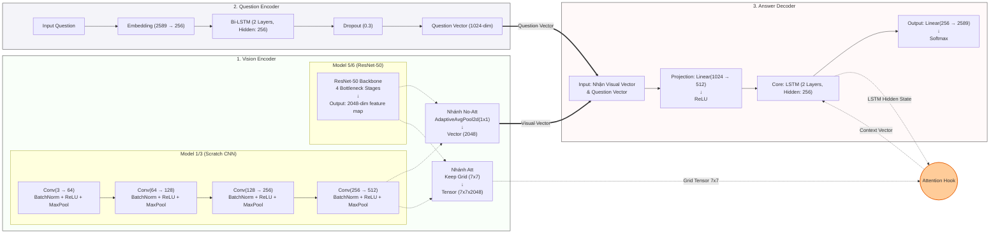

# Kiến trúc tổng quan mô hình VQA (Visual Question Answering)

Mô hình được chia làm 3 khối chính: Xử lý hình ảnh (Vision Encoder), Nhúng câu hỏi (Question Encoder) và Giải mã câu trả lời (Answer Decoder). Sơ đồ dưới đây trình bày luồng đi của dữ liệu bao gồm cả cơ chế giải mã thông thường lẫn có Attention.

